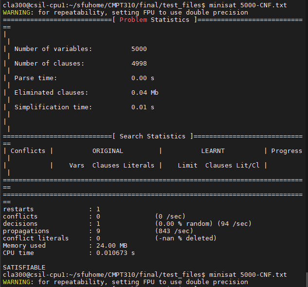
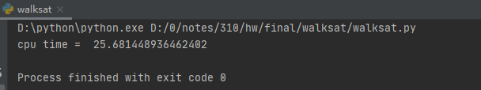
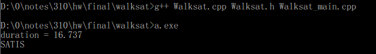
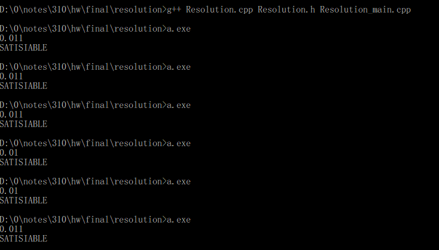

# CMPT 310 Final Project Report

## Project: Fast Implementations of WalkSAT and Resolution Proving

Language: C++

Libraries used: 

* iostream
* fstream
* cstdlib
* random
* map
* vector
* ctime

### WalkSAT

In Walksat.cpp, there are a class `Walksat`, which contains the basic elements in the walksat algorithm as private member variables: 

* `clauses` - a 2-D vector that contains all the literals in the sat problem, all the literals are represented by integer. 
* `num_vble` - the number of variables involved in this sat problem.
* `num_clauses` - the number of clauses in this sat problem.

Some functions are public methods:

* `Walksat()` - constructor

* `~Walksat()` - deconstructor

* Three getters to get the values of private member variable:

  ```c++
  vector<vector<int>> get_clauses();
  int get_num_vbles();
  int get_num_clauses();
  ```

* `readfile()` - this method is to read the text file of the sat problem from local storage to memory.
* `split_input()`- since the data read from files are strings, and the for each clause, it is a string, but when dealing with the data, we need them to be integers, so to split the input is necessary.
* `is_sat()` - To check if the clause is satisfiable or not.
* `get_num_sat_clauses()` - I write this method due to a trick in my main walksat function. If the random probability is less than the probability given, the program will not flip any variable, which is time consuming, so this function will help the program to find a variable to flip so that the flipping action getting more satisfiable clauses. 
* `get_unsat_clauses()` - This function returns all the unsatisfiable clauses, so that it's easier to find an unsatisfiable clause. It speeds up the program since the useless action to random flip the literals to make an satisfiable clause to unsatisfiable clauses will appear less.
* `model` - I use a similar data structure to store the model as in `logic.py` in our textbook code. `model` is a map data structure. The first variable for each element is an integer to store the variables appear in the sat problem. The second variable is a boolean to store the truth value of the corresponding variables. 
* `walksat_alg()` - The function first initialize a model and find all unsatisfied clauses, then randomly choose a clause in those clauses and randomly choose a variable in the chosen clause to flip. If the randomly generated probability is less than the given probability, it does exploration - randomly flip an literal in the chosen clauses. Otherwise, it does exploitation - flip the literal that adds more satisfied clauses. Repeat these actions except initializing a model, until there's no more unsatisfied clauses (the satisfiable result), or it used up the number of flips we indicated (the unsatisfiable result).


### Resolution Proving

In Resolution.cpp, there is a class `Resolution`, which contains the basic elements that the resolution proving algorithm uses:

* `clauses` - a 2-D vector that contains all the literals in the sat problem, all the literals are represented by integer. 
* `num_vble` - the number of variables involved in this sat problem.
* `num_clauses` - the number of clauses in this sat problem.

The public methods in Resolution Proving:

* `Resolution()` - constructor

* `~Resolution()` - deconstructor

* Three getters to get the values of private variables

  ```c++
  vector<vector<int>> get_clauses();
  int get_nvbles();
  int get_nclauses();
  ```

* `readfile()` - this method is to read the text file of the sat problem from local storage to memory.

* `split_input()` - since the data read from files are strings, and the for each clause, it is a string, but when dealing with the data, we need them to be integers, so to split the input is necessary.

* `KB` - use `map` data structure, which is similar as `dict` in python. it stores the variables in the sat problem as keys, and stores a boolean value as value in the `map` data structure corresponds to each variable. 

* `full_resolution()`

  * The function stores the variables in KB if it doesn't appear before.
  * If the variable appears before, then compare it with the value stored in `KB`. If the boolean value matches, the variable still keep in the `KB`; if it does not matches, i.e. the variable is true in one clauses and false in another clauses, then the resolution occurs, we delete the variable in `KB`. 
  * Repeat these processes until all the clauses has been checked. 
  * If the resulting `KB` is empty, which means that there is a contradiction, so it's unsatisfiable. 
  * Otherwise, it is satisfiable.

### Sample results

* minisat

  

* python WalkSat

  

* Walksat.cpp

  

* Resolution.cpp

  

## Running Time Comparisons 

(unit: in seconds) Data are getting from average of serval runs

| SAT proablem | minisat  | python    | Walksat.cpp | Resolution.cpp |
| ------------ | -------- | --------- | ----------- | -------------- |
| queens2.txt  | 0.003804 | 0.072976  | 0.048       | 0              |
| queens3.txt  | 0.003413 | 0.167944  | 0.100       | 0              |
| 3000-CNF.txt | 0.015257 | 16.891000 | 15.426      | 0.008          |
| 5000-CNF.txt | 0.010487 | 25.320537 | 16.737      | 0.011          |

From this table, we can see that minisat is the very fast that almost done all cases in less than 0.016 seconds, the python WalkSAT and C++ Walksat.cpp are less efficient than minisat. However, the C++ Walksat.cpp is more efficient than python WalkSAT, especially then dataset gets larger. The C++ Resolution.cpp is the most efficient one in this table, the efficiency is similar to minisat. 